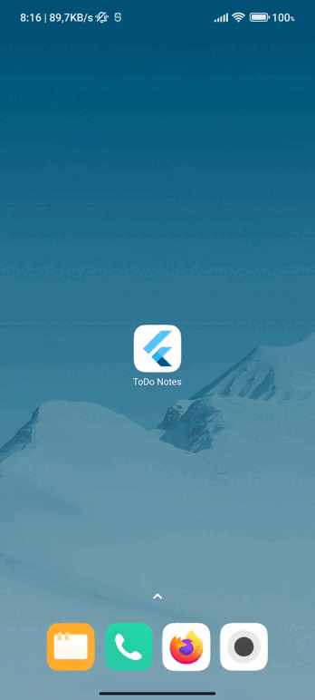

English | [Portuguese](./README.pt-BR.md)

<h1 align="center">ToDo App</h1>

A ToDo Notes App made with Flutter.

## Architecture

- Repository for communication with database.
- [BLoC](https://pub.dev/packages/flutter_bloc) for state management.
- [Hive](https://pub.dev/packages/hive_flutter) for data persistence.

## App Preview

